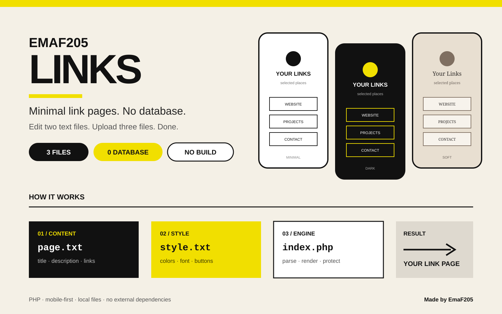
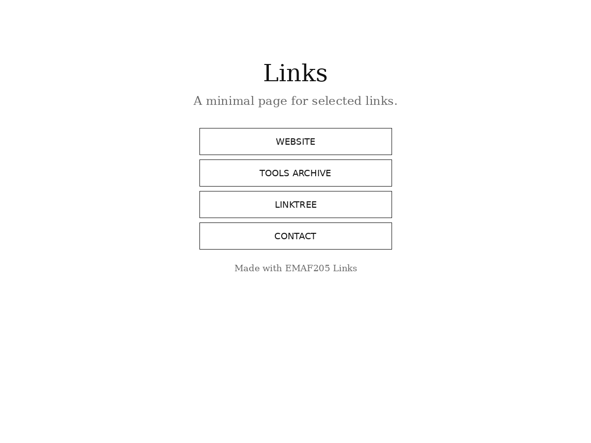
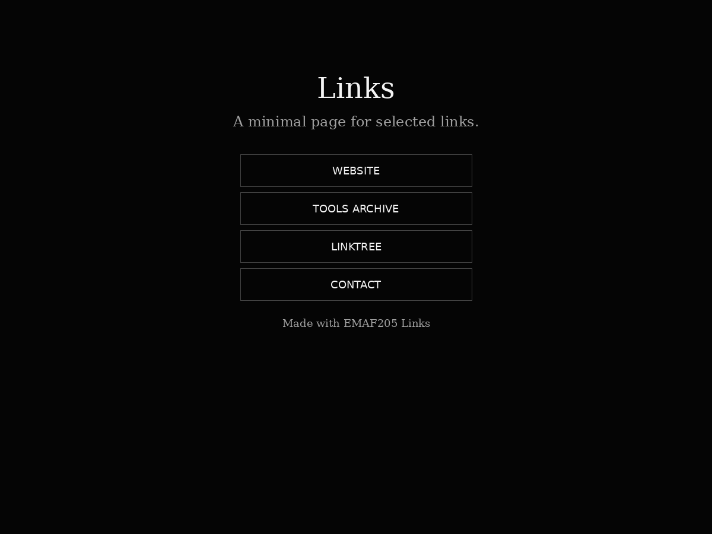
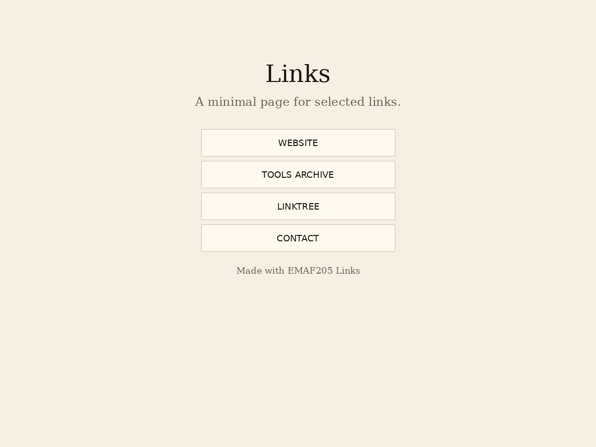

<p align="center">
  
</p>

# EMAF205 Links

**A tiny PHP link-page system built around three files.** Edit the content, optionally change the style, upload the folder, and your page is live.

No database. No admin panel. No build step. No framework. No external dependency.

## How it works

```text
page.txt   → content
style.txt  → visual settings
index.php  → parse + render
                ↓
          your public link page
```

### `page.txt` — content only

Change the page title, description, buttons, destinations and footer without touching PHP. The current format supports `SITE_TITLE`, `SITE_DESCRIPTION`, reusable `ITEM` blocks, `TITLE`, `URL`, `TARGET` and `FOOTER_TEXT`.

### `style.txt` — style only

Optionally control:

- background color
- text color
- serif / sans font
- button background
- button text color
- button border color

Leave the fields empty to use the default minimal theme.

### `index.php` — the engine

Handles parsing, rendering and basic safety checks. It escapes rendered values, validates HEX colors, blocks unsafe `javascript:`, `data:` and `vbscript:` URL schemes, and adds `rel="noopener"` to links opened in a new tab.

## Quick start

1. Download or clone this repository.
2. Edit `page.txt` with your links.
3. Optionally edit `style.txt`.
4. Upload `index.php`, `page.txt` and `style.txt` to a PHP-enabled folder.
5. Open that folder in your browser.

That's it.

## Example `page.txt`

```text
SITE_TITLE: Links
SITE_DESCRIPTION: A minimal page for selected links.

ITEM: website
TITLE: Website
URL: https://example.com
TARGET: _blank

ITEM: contact
TITLE: Contact
URL: mailto:hello@example.com
TARGET: _self

FOOTER_TEXT: Made with EMAF205 Links
```

## Preview

| Minimal | Dark | Soft |
|---|---|---|
|  |  |  |

## Built for

- personal link pages
- creator / portfolio links
- project landing pages
- workshop resources
- temporary campaigns
- public resource lists

## Design principles

- mobile-first
- compact layout
- square buttons
- uppercase button labels
- intentionally lightweight styling
- content and presentation kept separate

## Requirements

- a web server with PHP
- no database
- no Node.js
- no package manager
- no build process

## Project structure

```text
EmaF205-LinksX/
├── index.php
├── page.txt
├── style.txt
├── assets/
│   ├── emaf205-links-hero.svg
│   ├── preview-minimal.png
│   ├── preview-dark.png
│   └── preview-soft.png
├── demo/
├── dist/
├── docs/
├── release/
├── CHANGELOG.md
└── LICENSE
```

## Download

A ready-to-use package is available in:

```text
dist/EMAF205-Links.zip
```

## License

MIT License. See [`LICENSE`](LICENSE).

---

**Made with ❤️ in Milan by EmaF205**  
[Linktree](https://linktr.ee/emaf205) · `emagumroad@gmail.com`
